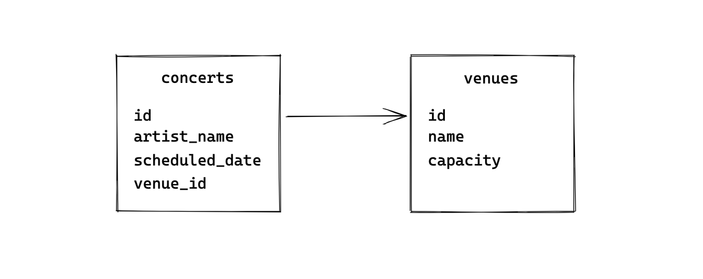

# Designing a schema with two tables

_**This is a Makers Vine.** Vines are designed to gradually build up
sophisticated skills. They contain a mixture of text and video, and may contain
some challenge exercises without proposed solutions. [Read more about how to use
Makers
Vines.](https://github.com/makersacademy/course/blob/main/labels/vines.md)_

Learn to design and create a schema with two tables and a foreign key.

## Introduction

You've learned how to design a schema with a single table. Often, we will need
to store different kind of records in our programs — for example, _albums and
artists_, for a music library, or _posts and comments_, for a blogging program.

Relational databases allow us to store different kind of records and "link" them
together, with the use of foreign keys. In the music library database, albums
are associated to their artist record using the `artist_id` foreign key.

In this section you'll learn how to design a schema using two related tables
from a plain English specification.

## Relationship types

In relational databases, there are different types of relationship possible
between two tables. First, you'll learn about **one-to-many**, which is probably
the most common type. One record in a table can be associated with many records
in another table, hence the name.   

Some examples: a musical artist can have many different albums. A country can
have many cities. A blog post can have many comments.

This relationship is designed by creating the **foreign key** column on one of
the tables. In the database `music_library`, we have an example of such a
relationship between the tables `albums` and `artists`.

> Think of having two tables `countries` and `cities`. Which table would have
> the foreign key referencing the other table? Why?

## Design Recipe

Follow this [Design Recipe](../resources/two_table_design_recipe_template.md) to
design the schema for two related tables. The outline is:

1. List all the nouns
2. Decide whether a noun is a record (a table name) or a property of it (a
   column).
3. Decide the column types.
4. Decide how the two tables will be related (where the foreign key is needed).
5. Write the SQL to create the tables.

*As always with user stories, it's good to always really think about what data
we need to store, rather than relying too much on the "extract nouns" technique,
when it leads to awkward results.*

## Demonstration

[Here's a video demonstration.](https://www.youtube.com/watch?v=k078sL3HBfU)

## Diagramming

It's useful to diagram as tables and their relationships become more complex, so
it's easier to communicate and visualise the database schema. Here's an example
of the schema created in the video demonstration, using
[Excalidraw](https://excalidraw.com/).



## Exercise

You should create a new database `student_directory_2` for this exercise.

Infer the table schema from these user stories.

```
As a coach
So I can get to know all students
I want to see a list of students' names.

As a coach
So I can get to know all students
I want to see a list of cohorts' names.

As a coach
So I can get to know all students
I want to see a list of cohorts' starting dates.

As a coach
So I can get to know all students
I want to see a list of students' cohorts.
```

1. Copy the Design Recipe template and use it to design the schema for the two
   tables.
2. Create the tables by loading the SQL file in `psql`.

[Example solution](https://www.youtube.com/watch?v=k078sL3HBfU&t=1364s)

## Configuring "Cascade" Deletion

When a record is deleted (e.g when a row in `artists` is deleted), we can
configure the database to automatically remove related records referencing it
(e.g delete all related `albums`), so there are no "orphans" records - this is
done using the `on delete cascade` SQL option, when creating the table:

```sql
-- This snippet is taken from the Two Tables Schema Design Recipe document
constraint fk_artist foreign key(artist_id)
    references artists(id) 
    on delete cascade 
```

## Challenge

You should create a new database `blog` for this challenge.

Infer the table schema from these user stories.

1. Copy the Design Recipe template and use it to design the schema for the
   tables.
2. Create the tables by loading the SQL file in `psql`.

```
As a blogger
So I can write interesting stuff
I want to write posts having a title.

As a blogger
So I can write interesting stuff
I want to write posts having a content.

As a blogger
So I can let people comment on interesting stuff
I want to allow comments on my posts.

As a blogger
So I can let people comment on interesting stuff
I want the comments to have a content.

As a blogger
So I can let people comment on interesting stuff
I want the author to include their name in comments.
```


[Next Challenge](06_test_driving_write_operations.md)

<!-- BEGIN GENERATED SECTION DO NOT EDIT -->

---

**How was this resource?**  
[😫](https://airtable.com/shrUJ3t7KLMqVRFKR?prefill_Repository=makersacademy%2Fdatabases-in-python&prefill_File=challenges%2F05_designing_schema_two_tables.md&prefill_Sentiment=😫) [😕](https://airtable.com/shrUJ3t7KLMqVRFKR?prefill_Repository=makersacademy%2Fdatabases-in-python&prefill_File=challenges%2F05_designing_schema_two_tables.md&prefill_Sentiment=😕) [😐](https://airtable.com/shrUJ3t7KLMqVRFKR?prefill_Repository=makersacademy%2Fdatabases-in-python&prefill_File=challenges%2F05_designing_schema_two_tables.md&prefill_Sentiment=😐) [🙂](https://airtable.com/shrUJ3t7KLMqVRFKR?prefill_Repository=makersacademy%2Fdatabases-in-python&prefill_File=challenges%2F05_designing_schema_two_tables.md&prefill_Sentiment=🙂) [😀](https://airtable.com/shrUJ3t7KLMqVRFKR?prefill_Repository=makersacademy%2Fdatabases-in-python&prefill_File=challenges%2F05_designing_schema_two_tables.md&prefill_Sentiment=😀)  
Click an emoji to tell us.

<!-- END GENERATED SECTION DO NOT EDIT -->
